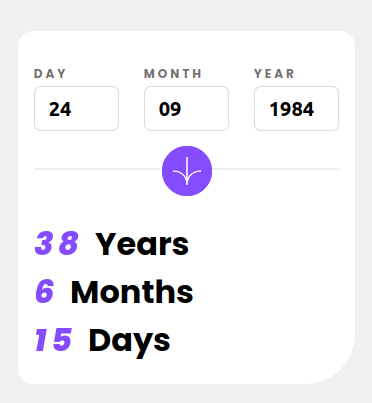
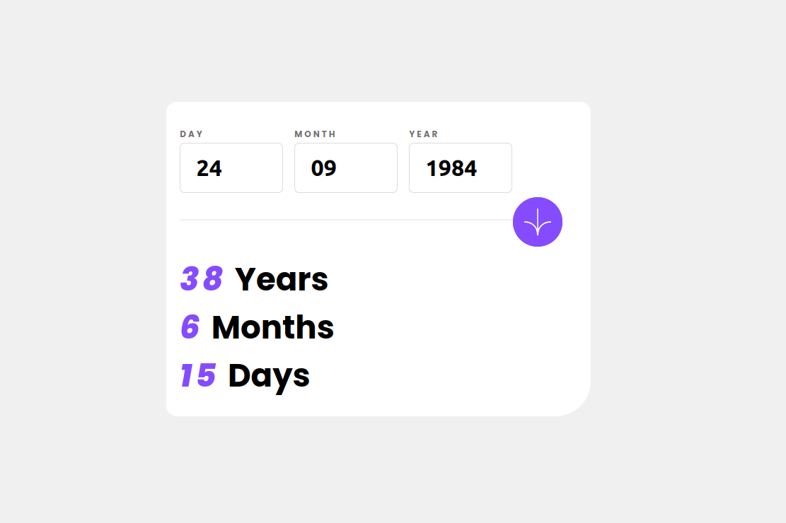

# Frontend Mentor - Age calculator app solution

This is a solution to the [Age calculator app challenge on Frontend Mentor](https://www.frontendmentor.io/challenges/age-calculator-app-dF9DFFpj-Q).

## Table of contents

- [Overview](#overview)
  - [The challenge](#the-challenge)
  - [Screenshot](#screenshot)
  - [Links](#links)
- [My process](#my-process)
  - [Built with](#built-with)
  - [What I learned](#what-i-learned)
  - [Continued development](#continued-development)
  - [Useful resources](#useful-resources)
- [Author](#author)
- [Acknowledgments](#acknowledgments)

## Overview

### The challenge

Users should be able to:

- View an age in years, months, and days after submitting a valid date through the form
- Receive validation errors if:
  - Any field is empty when the form is submitted
  - The day number is not between 1-31
  - The month number is not between 1-12
  - The year is in the future
  - The date is invalid e.g. 31/04/1991 (there are 30 days in April)
- View the optimal layout for the interface depending on their device's screen size
- See hover and focus states for all interactive elements on the page
- **Bonus**: See the age numbers animate to their final number when the form is submitted

### Screenshot

- Mobile View

- Desktop View

### Links

- Solution URL: [GitHub](https://your-solution-url.com)
- Live Site URL: [Vercel](https://your-live-site-url.com)

## My process

### Built with

- Semantic HTML5 markup
- CSS custom properties
- Flexbox
- Mobile-first workflow
- Vite
- [React](https://reactjs.org/) - JS library

### What I learned

I learned more about the useState Hook and lifting state up so that props data passed to children component by parents are kept consistent across board

### Continued development

I really want to improve in my knowledge of react and following react best practices as well as writing clean code that can be referenced and debugged later on easily.

### Useful resources

- [React Documentation](https://react.dev/learn/) - This helped me understand the basics of react and some of the bare react best practices, awesome documentation by the react team.

## Author

- Frontend Mentor - [@Julius-Java](https://www.frontendmentor.io/profile/julius-java)
- Twitter - [@Julius_Java00](https://www.twitter.com/julius_java00)
